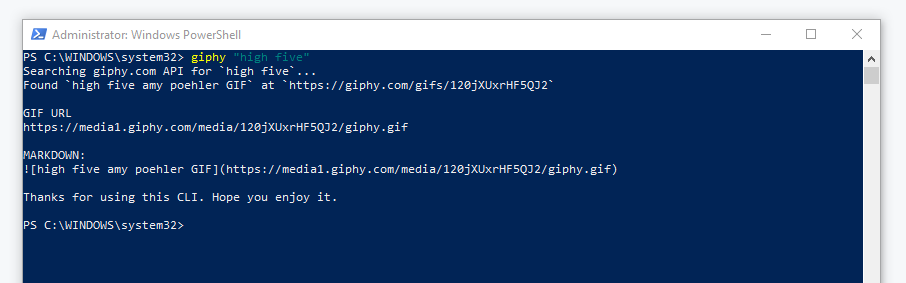

# giphy-cli
A .NET Global tool to search for a gif on Giphy and optionally open the link in the browser or copy the link or markdown to the clipboard.

Comments, ideas, bug reports and PR are welcome here.


## Get started

Head over to [GiphyCli on NuGet](https://www.nuget.org/packages/GiphyCli) or continue reading:

You'll need the [.NET 5](https://www.microsoft.com/net/download) or newer.

Install the Giphy CLI with this command:

```
> dotnet tool install --global GiphyCli
```

Update the Giphy CLI with this command:

```
> dotnet tool update --global Giphycli
```

To search for a gif, simply use

```
> giphy lolcats
```

## Usage

```
> giphy cheeseburger
> giphy "awesome cheeseburger"
```

Output markdown only, great for using in notebooks.
```
> giphy cheeseburger -m
> giphy cheeseburger --markdown
```

Giphy CLI now an includes interactive prompt.



Have markdown copied to clipboard _et voila_.


## Features

- Interactive prompt: Open giphy.com URL, copy .gif deeplink or __copy markdown to clipboard__
- Preview image in iTerm2 (PR by https://github.com/slang25) 
